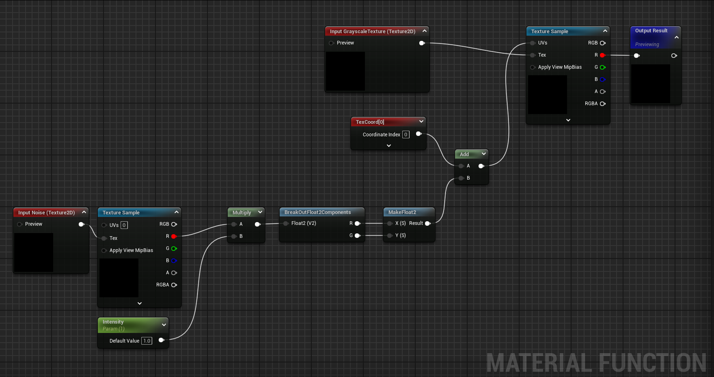
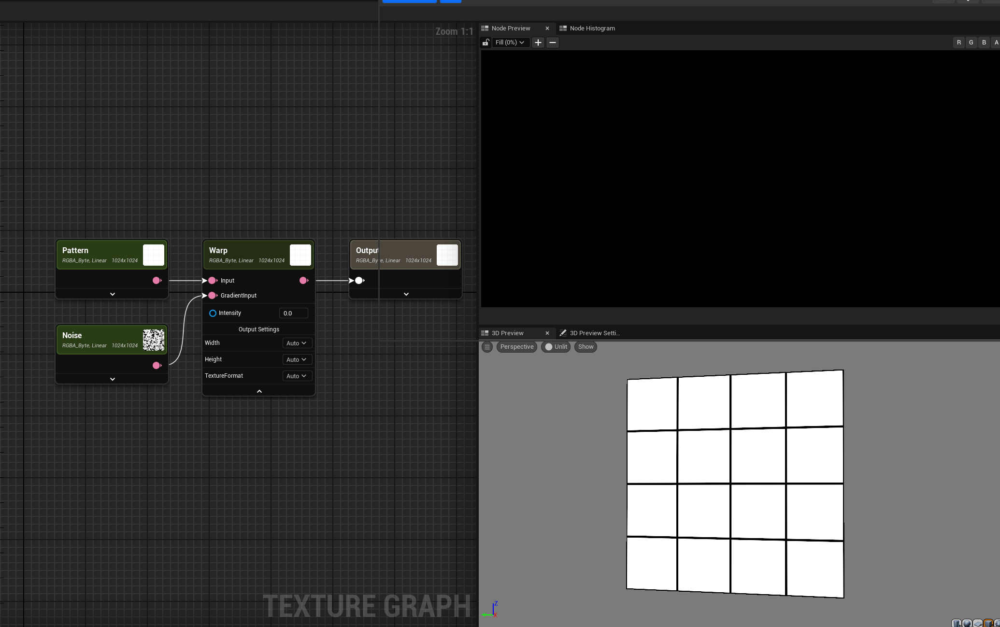

# Custom Node Unreal Texture Graph

### Introduction

Unreal released a Plugin coming with the Engine called `Texture Graph`. You can check out the documentation [here](https://dev.epicgames.com/community/learning/tutorials/z0VJ/unreal-engine-getting-started-with-texture-graph).

As I have been working with `Substance Designer` lately I tried this plugin out and thought: “How cool would it be to make custom nodes”.

### Background

I discovered two ways doing it:

- Create a `MaterialFunction` and use it directly in the `Texture Graph`
- Code a custom node that you can use natively.

To be able to use a Material Function right in the Texture Graph is great way of extending the feature set. One downside is that you always have to bring them from one project to another and it becomes very tedious to set them and hard to read in the graph.

So I thought why not make my own. I settled on a `Warp` node, because its a great base for other custom nodes, like `Directional Warp` or `Slope Blur` that I could make later.

### Planning

But first I we need a simple warp MF (Material Function) in Unreal to test and have as a base.

Alright, let's talk about warping a texture. It's like taking a rubber sheet with an image on it and stretching or squishing different parts. In the world of game dev and computer graphics, this is super useful for creating all sorts of cool effects.

Here's the gist of it:

- You start with a normal texture - could be anything, like a brick wall or a wooden floor.
- Then you've got this thing called a warp map. Think of it as a set of instructions telling the texture where to bend and stretch, here I just use a perlin noise texture.
- When you apply the warp, it's like the texture is being pushed and pulled based on the warp map.

The cool part? You can use this to make stuff like:

- Water ripples that actually look like they're moving
- Heat haze that shimmers and distorts what's behind it
- Fabric that looks like it's folding and creasing realistically

In a Warp node (like the one I'm trying to make), you'd typically plug in your main texture and your warp map. The node then does its magic, giving you back a warped version of your original texture.



The Texture Graph can just take a MF and set the input and output connections, which is very neat, but also time consuming for basic nodes and harder to read in the graph.

A native Warp node is much cleaner and easier to use. Here is how I did it?


### Development Setup

The `Texture Graph` plugin is coming along with the engine and can just be explored. To work on it we have to prepare some steps.

- If you cannot see the `SLN` project files, right click on the project and click `Generate Visual Studio Project Files`
- Installing `Visual Studio Integration Tool` from the FAB store [here]([https://www.fab.com/listings/8a639215-7f85-4cc7-b155-fa2137326209](https://www.fab.com/listings/8a639215-7f85-4cc7-b155-fa2137326209))

This will help you setup multiple things in Visual Studio seen here.


- Create a `Plugin` folder in your project root and copy the `Texture Graph` plugin from the `engine/plugins/experimental/` folder.
- Delete the `Binaries` and `Intermediate` folder.

Once everything is setup we can open the Project in Visual Studio.

### Implementation

I knew I wanted to have my Warp node as another filter so I was looking into the `Blur` filter to see how it works.

The way this is setup is really sweet. We can just add a new filter in by creating two Classes and one USF shader file.

> USF files are Unreal Shader Files. Unreal uses HLSL shader language and all our shaders here include `"/Engine/Public/Platform.ush"` (Unreal Shader Header). Which we need for compilation. More on shaders in plugin development can be found [here](https://dev.epicgames.com/documentation/en-us/unreal-engine/overview-of-shaders-in-plugins-unreal-engine?application_version=5.5).
> 

- `T_Warp.h[cpp]` in `TextureGraphEngine/Transform`
- `TG_Expression_Warp.h[cpp]` in `Source/TextureGraph/Public[Private]/Expressions/Filter`
- `Expression_Warp.usf` in `Shaders/Expressions`

In the `TG_Expression_Warp` we define that it is a filter with `TG_Category::Filter` and all the input, outputs and settings.

- Intensity: float (Intensity of the warp)
- Input: FTG_Texture (The texture we want to warp)
- GradientInput: FTG_Texture (The texture that drives the warp)
- Output: FTG_Texture (Result output, also a texture)

```cpp
UCLASS()
class TEXTUREGRAPH_API UTG_Expression_Warp : public UTG_Expression
{
    GENERATED_BODY()

public:
    TG_DECLARE_EXPRESSION(TG_Category::Filter);

#if WITH_EDITOR
    // Used to implement EditCondition logic for both Node UI and Details View
    virtual bool CanEditChange(const FProperty *InProperty) const override;
#endif

    // Adjusting the intensity of the warp."
   UPROPERTY(EditAnywhere, Category = NoCategory, meta = (TGType = "TG_Setting", PinDisplayName = "Intensity", UIMin = "0", ClampMin = "0", UIMax = "1", ClampMax = "1", MD_ScalarEditor))
    float Intensity = 1.0f;

    // The input texture to apply the warp effect
    UPROPERTY(meta = (TGType = "TG_Input"))
    FTG_Texture Input;

    // The input texture to apply the warp effect
    UPROPERTY(meta = (TGType = "TG_Input"))
    FTG_Texture GradientInput;

    // The output texture having warp effect
    UPROPERTY(EditAnywhere, Category = NoCategory, meta = (TGType = "TG_Output", PinDisplayName = ""))
    FTG_Texture Output;

    virtual FText GetTooltipText() const override { return FText::FromString(TEXT("Applies a warp filter with noise and a given inensity.")); }
    virtual void Evaluate(FTG_EvaluationContext *InContext) override;
```

We override the Evaluate from the expression base class, this will be called whenever a setting, input or output is changed in the node.

And we call `T_Warp::CreateWarp` which handles the shader parameters and the passing to the shader as well the rendering calls.

```cpp
void UTG_Expression_Warp::Evaluate(FTG_EvaluationContext *InContext)
{
    Super::Evaluate(InContext);

    if (Input)
    {
        Output = T_Warp::CreateWarp(InContext->Cycle, Output.GetBufferDescriptor(), Input, GradientInput, Intensity, InContext->TargetId);
    }
    else
    {
        Output = TextureHelper::GetBlack();
    }
}
```

In the FSH_Warp we have a macro helpers to define the shader struct with the parameters, which we all then can use in the shader.

- `FTIleInfo` automatically holds all the information about tiling, like tile count , index on x and y and tile width and height.
- `FStandardSamplerStates` is useful for telling in the shader how we want to sample the textures, like linear or wrap.
- Then the 2 texture we want to use in the shader, `SourceTexture` and `SourceGradient`

```cpp
class TEXTUREGRAPHENGINE_API FSH_Warp : public FSH_Base
{
public:
    DECLARE_GLOBAL_SHADER(FSH_Warp);
    SHADER_USE_PARAMETER_STRUCT(FSH_Warp, FSH_Base);
    BEGIN_SHADER_PARAMETER_STRUCT(FParameters, )
        SHADER_PARAMETER_STRUCT(FTileInfo, TileInfo)
        SHADER_PARAMETER_STRUCT(FStandardSamplerStates, SamplerStates)
        SHADER_PARAMETER_TEXTURE(Texture2D, SourceTexture)
        SHADER_PARAMETER_TEXTURE(Texture2D, SourceGradient)
        SHADER_PARAMETER(float, Intensity)
    END_SHADER_PARAMETER_STRUCT()

public:
    static bool ShouldCompilePermutation(const FGlobalShaderPermutationParameters &Parameters)
    {
        return IsPCPlatform(Parameters.Platform) && EnumHasAllFlags(Parameters.Flags, EShaderPermutationFlags::HasEditorOnlyData);
    }
};

class TEXTUREGRAPHENGINE_API T_Warp
{
public:
    
    T_Warp();
    ~T_Warp();

    static TiledBlobPtr CreateWarp(MixUpdateCyclePtr InCycle, BufferDescriptor DesiredDesc, TiledBlobPtr SourceTexture, TiledBlobPtr SourceGradient, float Intensity, int InTargetId);
};
```

The last step before the shader code is to create pointers to our textures and assign all arguments to our `RenderJob` so we can use it in the shader.

If we do not have both textures plugged in the warp node, we do not have a valid pointer to a texture, so instead we return a black texture instead.

The `TextureHelper::GetBlack()` will exactly to that for us.

```cpp
TiledBlobPtr T_Warp::CreateWarp(MixUpdateCyclePtr InCycle, BufferDescriptor DesiredDesc, TiledBlobPtr SourceTexture, TiledBlobPtr SourceGradient, float Intensity, int InTargetId)
{
    if (SourceTexture && SourceGradient)
    {
        RenderMaterial_FXPtr RenderMaterial = TextureGraphEngine::GetMaterialManager()->CreateMaterial_FX<VSH_Simple, FSH_Warp>(TEXT("T_Warp"));
        check(RenderMaterial);

        // Combine the tiled texture
        TiledBlobPtr CombinedBlob = T_CombineTiledBlob::Create(InCycle, SourceTexture->GetDescriptor(), InTargetId, SourceTexture);
        TiledBlobPtr  CombinedBlob2 = T_CombineTiledBlob::Create(InCycle, SourceGradient->GetDescriptor(), InTargetId, SourceGradient);
              

        FTileInfo TileInfo;

        JobUPtr RenderJob = std::make_unique<Job>(InCycle->GetMix(), InTargetId, std::static_pointer_cast<BlobTransform>(RenderMaterial));
        RenderJob
            ->AddArg(ARG_TILEINFO(TileInfo, "TileInfo"))
            ->AddArg(ARG_BLOB(CombinedBlob, "SourceTexture"))
            ->AddArg(ARG_BLOB(CombinedBlob2, "SourceGradient"))
            ->AddArg(ARG_FLOAT(Intensity, "Intensity"));

        const FString Name = FString::Printf(TEXT("T_Warp.[%llu]"), InCycle->GetBatch()->GetBatchId());

        TiledBlobPtr Result = RenderJob->InitResult(Name, &DesiredDesc);
        InCycle->AddJob(InTargetId, std::move(RenderJob));

        return Result;
    }

    return TextureHelper::GetBlack();
}
```

Everything before was mostly setup for actually doing the warping in the shader.

Here we get the correct UV ratio form the `TileInfo_fromCurrentTileToLayer` with the UV parameter, that we later can use to sample our textures correctly with `TextureName.Sample`.

Intensity then gets multiplied with our intensity and clamped to 255.

As we add our noistexture with the UV coordinates we want to make sure that if they exceed the UV space from 0-1 to offset them by one again so we can a nice tiling effect.

The last step is to sample our SourceTexture with the warped UV coordinates.

```cpp
Texture2D SourceTexture;
Texture2D SourceGradient;
float Intensity;

float4 FSH_Warp(float2 uv : TEXCOORD0) : SV_Target0
{   
    float2 SourceTexelUV = TileInfo_fromCurrentTileToLayer(uv);

    float4 pixelGradientValue = SourceGradient.Sample(
	    SamplerStates_NoBorder, 
	    SourceTexelUV);    
	    
    float4 noiseTexture = clamp(pixelGradientValue * Intensity, 0, 255);
    
  
    // wrap uv when bigger than 1
    float2 uv_noise = float2(
	    (noiseTexture.x + SourceTexelUV.x) % 1,
	    ((noiseTexture.y + SourceTexelUV.y) % 1));
  
    float4 pixelSourceValue = SourceTexture.Sample(
	    SamplerStates_NoBorder, 
	    uv_noise);
 
    return pixelSourceValue;
 
}
```

The result is a warp node that we can natively use in the TextureGraph of Unreal.


And warp textures like this.



Remember when we set the category filter? This defines where we can see the node in the node list.

And here it is, directly in the menu 😊 How cool is that?


### Conclusion

Overall the development was not to hard. It took me a bit to figure out how everything works as there is no direct documentation for this and the plugin is still in experimental stage.

There also some things that could have been improved, as a learning project and a start into developing new nodes for the Texture Graph, this was a great experience.

Why did I start with a warp node?

The warp is a very essential tool to build up procedural textures and this is a stepping stone into developing `Directional Warp` , `Slope Blur` , `Multidirectional Warp` nodes and many more.

As of writing this article, Unreal Engine 5.5 was released and with a new Texture Graph plugin version with its own Warp node. This is a great opportunity to compare and learn if you want.

I personally think the Texture Graph is a great tool for quick texture changes and I’m excited for what will be released in the future.

### Resources

Here are some links if you want dive deeper in the topic.

[https://github.com/EpicGames/UnrealEngine](https://github.com/EpicGames/UnrealEngine)

[https://dev.epicgames.com/documentation/en-us/unreal-engine/overview-of-shaders-in-plugins-unreal-engine?application_version=5.5](https://dev.epicgames.com/documentation/en-us/unreal-engine/overview-of-shaders-in-plugins-unreal-engine?application_version=5.5)

[https://learn.microsoft.com/en-us/visualstudio/gamedev/unreal/get-started/vs-tools-unreal-install](https://learn.microsoft.com/en-us/visualstudio/gamedev/unreal/get-started/vs-tools-unreal-install)

[https://en.wikipedia.org/wiki/Texture_filtering](https://en.wikipedia.org/wiki/Texture_filtering)

[https://thebookofshaders.com/](https://thebookofshaders.com/)